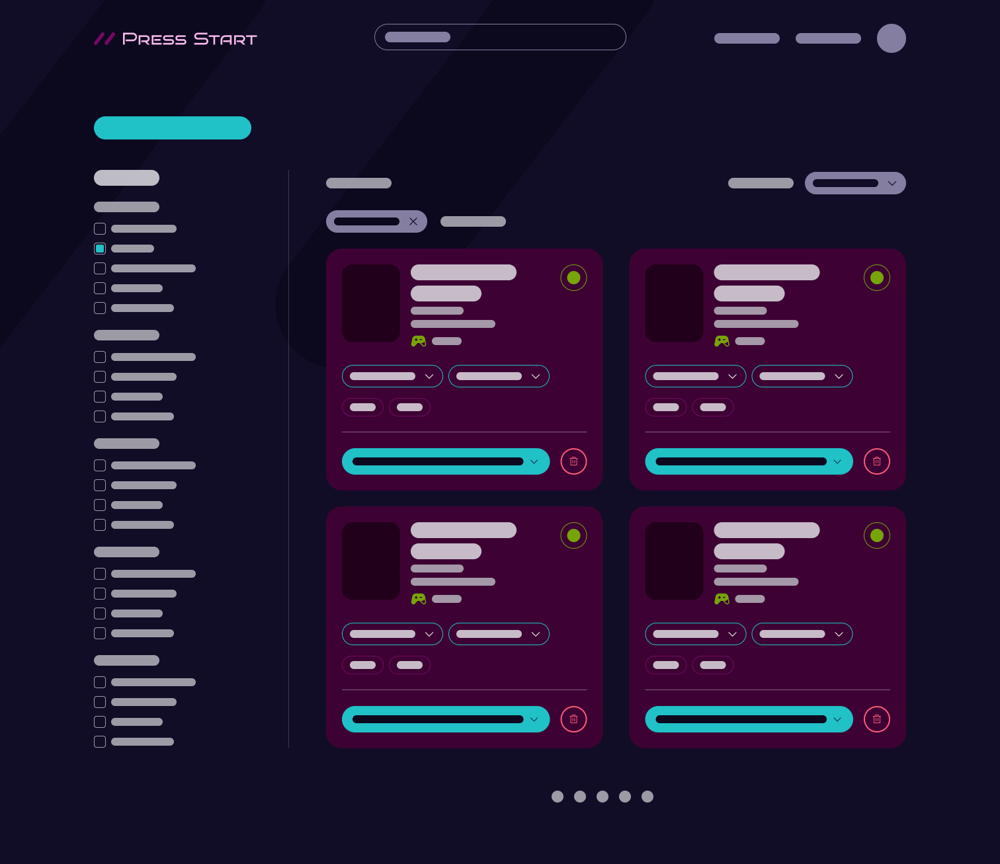
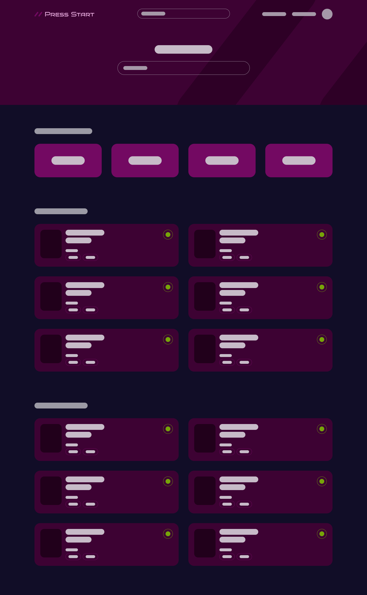
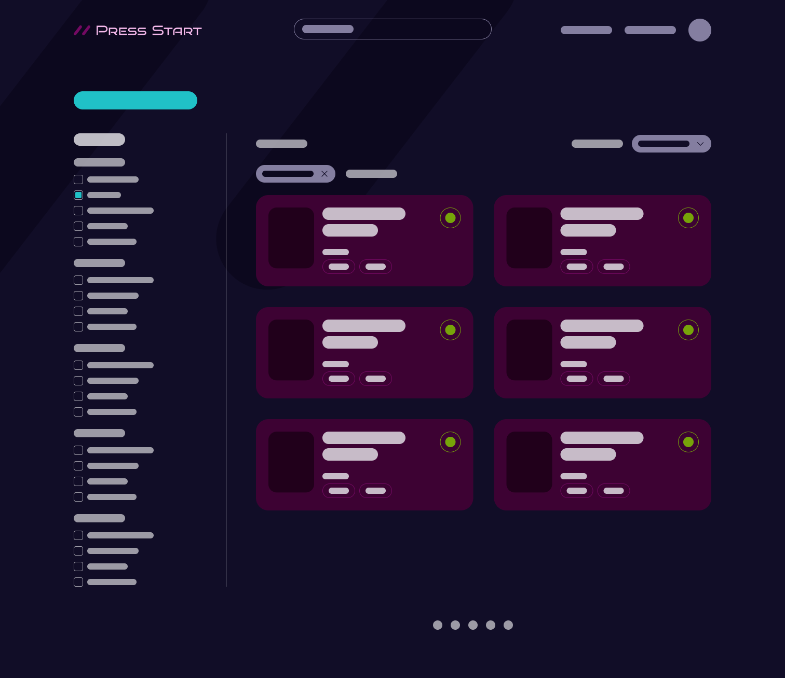
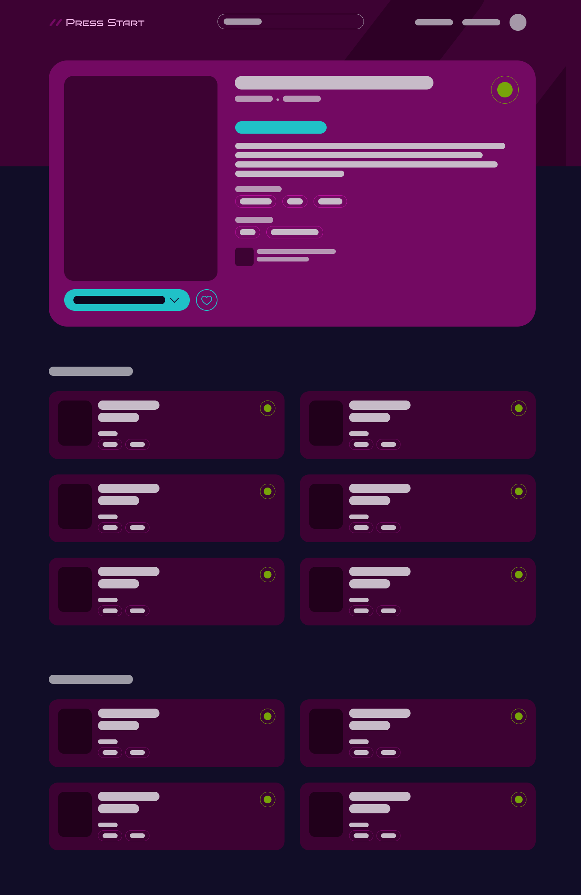

<picture>
  <source srcset="./public/press-start-logo-tagline-dark.svg" media="(prefers-color-scheme: light)">
  <source srcset="./public/press-start-logo-tagline-light.svg" media="(prefers-color-scheme: dark)">
  
</picture>

## Getting Started

1. Clone repositories

   - https://github.com/janessaperry/press-start-client.git
   - https://github.com/janessaperry/press-start-server.git

2. Install dependencies in both client and server repos

   - npm install

3. Set up .env with necessary environment variables

   - Example .env files included in repos

4. Configure databases

   - Create a local database named press_start (or however you have named it in your server side .env file)
   - Run migration and seeds
     - npm run db:migrate
     - npm run db:seed

5. Configure IGDB API
   - Sign up for IGDB API (https://api-docs.igdb.com/#getting-started)
   - Create an application with the following settings
     - OAuth Redirect URLs: http://localhost
     - Category: Website Integration
     - Client Type: Confidential
     - Generate Client Secret
   - Using your Client ID and Client Secret, make a POST request to the endpoint below to obtain an access token
     - https://id.twitch.tv/oauth2/token?client_id=YOUR_CLIENT_ID&client_secret=YOUR_CLIENT_SECRET&grant_type=client_credentials
   - Add your Client ID and Access Token to the .env file as outline in example .env files

#### Still In the Works

- **Collection**
  - need to re-render stats, currently playing, and results if a user changes their collection options on this page
  - would like to refine console filters on this page so they are applicable to a user's collection
  - would like to add more filters such as Genre and Time to Beat
- **Explore**
  - would like to add more filters
- **Search Feature**
  - add "Search for [query string]" and direct users to a page of results if they select this option
- **Mobile Enhancements**
  - page header and filters need to be optimized for mobile

## Overview

Press Start is an app that helps users build and manage a personal collection of the video games they own. It allows them to track which games they have, what platform they’re on, and whether they are physical or digital. This MVP is designed for personal use, with user registration and authentication being added later if there is time.

### Problem Space

Gamers often find themselves stuck when deciding what to play next, especially when they can’t remember which games they already own. Managing a collection of games across multiple consoles and formats—digital and physical—makes it easy to forget about titles purchased during sales or lost in the shuffle. Press Start addresses this pain point by offering a centralized platform where users can organize all their games in one place, making it easy to see their collection and decide on their next adventure. Whether you’re in the mood for a quick puzzle game or an expansive RPG, Press Start helps you quickly identify which games are ready to play.

### User Profile

**:dart: Target Users**

- Gamers with collections spanning multiple platforms (consoles, PC, etc.).
- Players who need an efficient way to organize both physical and digital games.
- Users who want to quickly browse their game collection to decide what to play next.

### Features

**:mag: Browsing & Search**
Explore games by platform, release date, or searching by title.

**:gear: Collection Filters**
Filter games by status, platform, and format.

**:video_game: Game Management**
Users can add, edit, and delete games in their collection, specifying platform, format, and status.

**:desktop_computer: Responsive Design**
Largely responsive but best viewed on a desktop for now.

#### Future Enhancements

**:lock: User Registration & Login**
Allow users to create accounts to save their libraries and wishlists.

**:star2: Game Recommendations**
Suggest titles based on a user’s preferences and collection.

**:bell: Notifications**
Alert users about new game releases in franchises they own.

**:point_right: More Sorting and Filtering**
Continue to add sorting and filtering options to enhanced user experience.

**:iphone: Responsive Enhancments**
Make the site fully responsive.

## Implementation

### Tech Stack

**Front-end:** React, Sass, Axios, React Router, Phosphor
**Back-end:** Node.js, Express.js
**Database:** MySQL, Knex
**Authentication _(optional future enhancement)_:** Firebase

### APIs

IGDB (https://www.igdb.com/api)

### Sitemap

- **Landing Page _(optional future enhancement)_:** Overview of website, call to action to sign up.
- **Login/Register _(optional future enhancement)_:** User authentication.
- **Explore:** Users can search for games, or browse by platform, release date, etc.
- **Search Results:** List of games with pagination at the bottom and filters along the side for console, genre, etc.
- **Game Details:** Show details of a specific game along with Similar Games.
- **Collection:** User's collection of games where they can see everything they own and filter for what to play for next.
- **User Settings _(optional future enhancement)_:** Manage personal settings including avatar, email, and password.

### Mockups

#### Dashboard



#### Explore



#### Game List



#### Game Details



### Data

#### User

Represents each registered user.

- id _(primary key)_
- email
- password
- username

#### Collection

Represents relationship between a user and their game collection.

- id: _(primary key)_
- userId: _(foreign key)_
- gameId _(unique identifier for games in IGDB API)_
- gameStatus
  - Playing
  - Want to play
  - Played
  - Wishlist
- gameConsole
  - Xbox (X|S, One, 360)
  - PlayStation (PS5, PS4, PS3)
  - Nintendo (Switch, Wii U, Wii)
  - PC
  - MacOs
  - Linux
- gameFormat
  - Physical
  - Digital

### Endpoints

#### Proxy Server Endpoints

**GET /api/explore**

- Get list of games based on release date.

Response _(Status 200 OK)_

```
[
	{
		"id": 217554,
		"cover": "cover-url.png",
		"name": "Octopath Traveller II",
		"releaseDate": "Feb 23, 2023",
		"rating": "89",
		"genres": ["Role-playing (RPG)", "Turn-based strategy (TBS)"],
		"platforms": ["PC", "PS4", "Xbox One", "Switch", "PS5", "Xbox X|S"],
	},
	{...}
]
```

Response _(Status 500 Server Error)_

```
[
	{
		"message": "Error fetching new releases and coming soon games"
	}
]
```

**POST /api/explore/:platform/:page**

- Get list of games based on gaming Platform using Limit and Offset for pagination.
- POST request is being used to pass in filter options for Console and Genres.

Request Body

```
{
	"console": "(167,48)"
	"genres": "(4,5)"
}
```

Response _(Status 200 OK)_

```

[
	{
		"id": 217554,
		"cover": "cover-url.png",
		"name": "Octopath Traveller II",
		"rating": "89",
		"genres": ["Role-playing (RPG)", "Turn-based strategy (TBS)"],
		"platforms": ["PC", "PS4", "Xbox One", "Switch", "PS5", "Xbox X|S"],
	},
	{...}
]
```

Response _(Status 500 Server Error)_

```
[
	{
		"message": "Error fetching game data",
	}
]
```

**GET /api/game-details/:gameId**

- Get details for a game based on game ID.

Response _(Status 200 OK)_

```
{
	"id": 217554,
	"cover": "cover-url.png",
	"esrbRating": ["Mild Blood", "Use of Alcohol & Tobacco", "Fantasy Violence", "Suggestive Themes", "Mild Language"],
	"name": "Octopath Traveller II",
	"developer": "Square Enix",
	"releaseDate": "Feb 24, 2023",
	"summary": "This game is a brand-new entry in the Octopath Traveler series. It takes the series’ HD-2D graphics, a fusion of retro pixel art and 3DCG, to even greater heights. In the world of Solistia, eight new travelers venture forth into an exciting new era. Where will you go? What will you do? Whose tale will you bring to life? Every path is yours to take. Embark on an adventure all your own.",
	"rating": 89,
	"platforms": ["PC", "PS4", "Xbox One", "Switch", "PS5", "Xbox X|S"],
	"genres": ["Role-playing (RPG)", "Turn-based strategy (TBS)"],
	"similarGames": [
		{
			"id": 123,
			"cover": "cover-url.png",
			"name": "Title of Game",
			"rating": 86,
			"platforms": ["PC", "PS4", "Xbox One", "Switch", "PS5", "Xbox X|S"],
			"releaseDate": "Feb 24, 2023",
		},
		{...},
	],
}
```

**POST /api/search**

- Search for game by title.

Request Body

```
{
	"query": "queryString"
}
```

Response _(Status 200 OK)_

```
[
	{
		"id": 217554,
		"cover": "cover-url.png",
		"name": "Octopath Traveller II",
	},
	{...}
]
```

Response _(Status 500 Server Error)_

```
[
	{
		"message": "Error fetching search results",
	}
]
```

#### Database Endpoints

**POST /collection/page/:page**

- Gets list of games from users library

Request Header

```
Authorization: Bearer <access-token>
```

Response _(Status 200 OK)_

```
[
	{
		"id": 1,
		"userId": 1,
		"gameId": 26765,
		"gameName": "Octopath Traveler II",
		"gameCover": "octopath-cover.png",
		"gameStatus": "Want to play",
		"gameConsole": "Switch",
		"gameFormat": "Digital",
	},
	{
		"id": 2,
		"userId": 1,
		"gameId": 152202,
		"gameName": "Avatar: Frontiers of Pandora",
		"gameCover": "avatar-fop-cover.png",
		"gameStatus": "Played",
		"gameConsole": "PS5",
		"gameFormat": "Physical",
	}
]
```

Response _(Status 500 Server Error)_

```
{
	"message": "Error fetching collection data"
}
```

**POST /collection/:gameId**

- Adds game to user's collection

Request Header

```
Authorization: Bearer <access-token>
```

Request Body

```
{
	"gameId": 1942,
	"gameName": "The Witcher 3: Wild Hunt",
	"gameCover": "the-witcher-3.png",
	"gameStatus": "Want to play",
	"gameConsole": "Xbox X|S",
	"gameFormat": "Physical",
}
```

Response _(Status 201 Created)_

```
{
	"message": "Added game 1942 to collection"
	"id": 3,
	"userId": 1,
	"gameId": 1942,
	"gameName": "The Witcher 3: Wild Hunt",
	"gameCover": "the-witcher-3.png",
	"gameStatus": "Want to play",
	"gameConsole": "Xbox X|S",
	"gameFormat": "Physical",
}
```

Response _(Status 500 Server Error)_

```
{
	"message": "Error adding game to library",
	"gameId": "OK" || "Invalid gameId",
	"gameName": "OK" || "Invalid gameName",
	"gameCover": "OK" || "Invalid gameCover",
	"gameStatus": "OK" || "Invalid gameStatus",
	"gameConsole": "OK" || "Invalid gameConsole",
	"gameFormat": "OK" || "Invalid gameFormat",
}
```

**PATCH /collection/:gameId**

- Updates a game in user's collection. Users can update Status, Platform, and Format. The example below demonstrates an update to Game Status.

Request Header

```
Authorization: Bearer <access-token>
```

Request Body

```
{
	"gameStatus": "Playing",
}
```

Response _(Status 200 OK)_

```
{
	"message": "Updated game 1942 successfully",
}

```

Response _(Status 500 Server Error)_

```
{
	"message": "Error updating game 1942",
}
```

**DELETE /collection/:gameId**

- Removes game from user's collection by game id.

Request Header

```
Authorization: Bearer <access-token>
```

Response _(Status 204 No Content)_
No response body for status 204.

Response _(Status 500 Server Error)_

```
{
	"message": "Error deleting game 1942",
}
```

## Roadmap

**1. Planning & Setup**

- Finalize project goals and features.
- Set up project structure and development environment (including proxy server for API requests to IGDB).
- Mock up visuals for general direction of what site will look like.

**2. Front-end: Setup**

- Create basic layouts for collection, explore, game results, and game details.

**3. Backend: API & Database Setup**

- Set up database (MySQL, Knex).
- Build endpoints for user data and collection.

**4. Front-end: Game Details**

- Create a page for viewing individual game details (title, description, platform, etc.) using IGDB data.
- Ensure users can navigate back to search or their collection easily.

**5. Front-end: Game Browsing**

- Add a search feature to look up games.
- Integrate IGDB API to fetch and display game data based on query.
- Display results and allow users to filter and view game details.

**6. Front-end: Collection**

- Create page to display user's game collection.
- Add basic sorting and filtering (e.g., by platform or genre) for games in the collection.

**7. Styling & Responsive Design**

- Ensure site is fully responsive for both mobile and desktop.

**8. Testing & Debugging**

- Test all functionality to ensure everything is working.
- Debug any issues with IGDB integration or data handling.
- Ensure seamless navigation across pages.

**9. Implement Additional Features**

- If time allows, add user authentication.

**10. Deployment & Final Testing**

- Conduct final testing to ensure everything works after deployment.
- Prepare presentation and submit!

---

## Future Implementations

**User Registration / Authentication:** Allow others to sign up for site.

**Notifications:** Let user's know when a new game is released from a franchise that is in their collection.

**Game Recommendations:** Suggest games based on the user’s collection and preferences.
